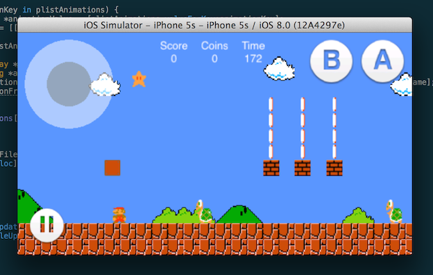
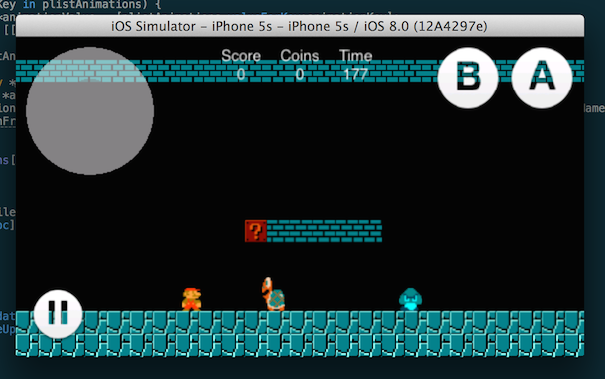

Super-Mario-Bros
================

A colleague of mine and I wanted to make a Super Mario Bros. remake for a long time.
So we did! 

The code is quite old and also super buggy because 

1. we didn't have a lot of programming knowledge/experience back then
2. we were under a lot of pressure because we didn't have a lot of time

So, I don't recommend using any of this code.

Also, please don't look at our commits, we were goofing around a lot 😄

## What it looks like

## Further Development

Well, if you'd like to spend precious time improving this pile of crap, please, go on.

## Known issues

- Physics (no, just no) 🐑💨

## Credits
- [Me](http://twitter.com/ilijatovilo)
- Lukas Seglias
- Nintendo (Thanks for not suing me)